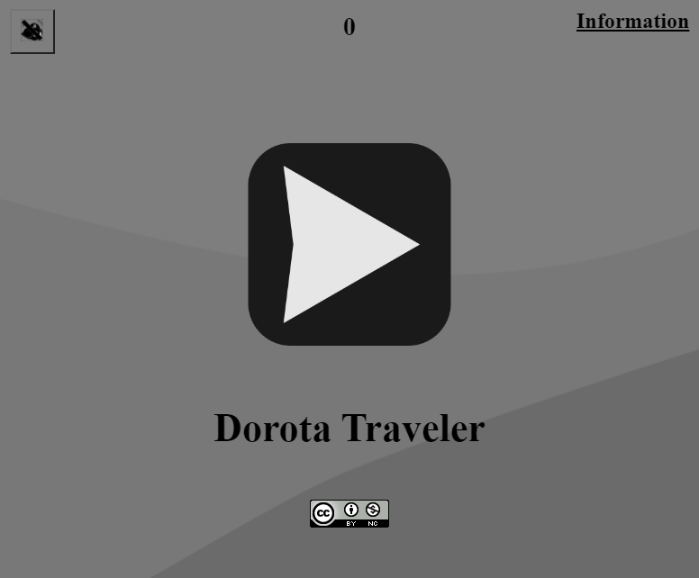
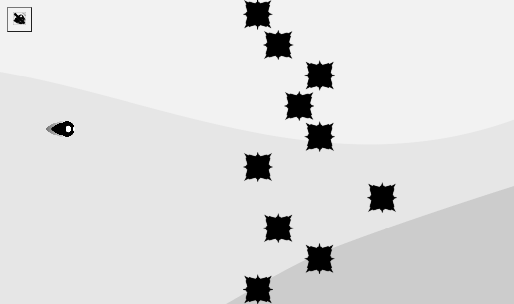
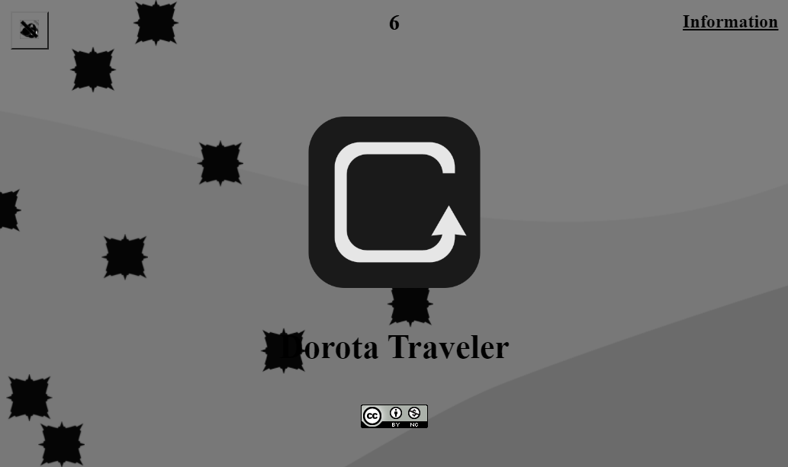
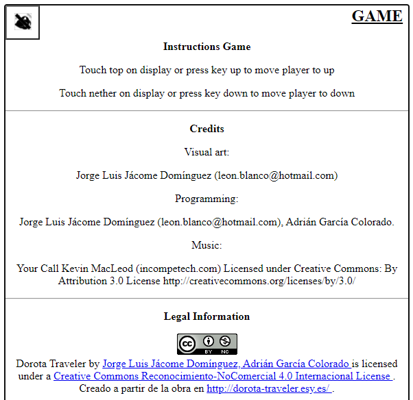

# Dorota Traveler
*******

Este proyecto adscribe a un VideoJuego Web llamado <strong>"Dorota Traveler"</strong>, el cual, fue desarrollado con HTML, CSS y JavaScript, y puede ser ejecutado desde cualquier Navegador Web.

### Instrucciones de ejecución

<ol>
    <li>
Descargar los archivos de este repositorio.
    
</li>
    <li>
Abrir el archivo <strong>"index.html"</strong> en un Navegador Web.
    </li>
</ol>

### Manual del VideoJuego

El VideoJuego <strong>"Dorota Traveler"</strong> presenta una interfaz de inicio con tres opciones:

<ul>
    <li>
Un botón en la esquina superior izquierda para activar o desactivar la música del VideoJuego.
    
</li>
    <li>
Una opción en la esquina superior derecha para conocer la forma de jugar el VideoJuego e información sobre sus autores.
    
</li>
    <li>
Un botón central, el cual, permite comenzar a jugar con el VideoJuego.
    
</li>
</ul>

 

 

El uso de <strong>"Dorota Traveler"</strong> se da a través de la teclas <strong>"Arriba"</strong> y <strong>"Abajo"</strong>, o si se accede desde el Navegador Web de un dispositivo móvil, para controlar el VideoJuego es necesario dar un toque en la parte superior, para que el personaje vaya hacia arriba, y un toque en la parte inferior, para que el personaje vaya hacia abajo.

 

 

El VideoJuego consiste en evadir una serie de obstáculos que parten desde la parte derecha de la pantalla, hacia la parte izquierda de la misma. En donde, si el personaje choca con algún obstáculo, el personaje explota y, entonces, aparece un botón central que permite volver a jugar el VideoJuego.

 

 

Finalmente, cabe mencionar que la opción <strong>"Información"</strong>, además de presentar la forma de hacer uso del VideoJuego y a los autores del mismo, tambien describe que autor hizo que parte y cita al elemento adicional utilizado para el desarrollo de <strong>"Dorota Traveler"</strong>.

 

*******
## Créditos

Autores: *Jorge Luis Jácome Domínguez* y *Adrián García Colorado*

######  Otros medios < [Linkedin](https://www.linkedin.com/in/jorge-luis-j%C3%A1come-dom%C3%ADnguez-44294a91/) - [Dibujando](https://dibujando.net/soragefroren) - [Facebook](https://www.facebook.com/SoraGefroren) - [Youtube](https://www.youtube.com/c/SoraGefroren) >

